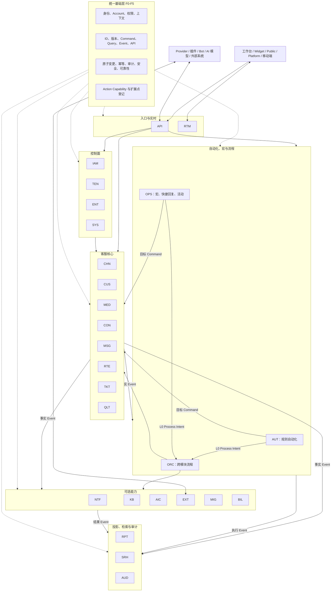

# 可扩展、简单实用、可跟踪、可量化、可分可合目标架构

> 本分册是现有需求的综合目标架构。它不增加新的业务模块，而是确定 26 个模块如何组合部署、如何按需拆分，以及自动化、宏、AI、插件、日志和核心客服如何使用同一基础层。

## 1. 架构目标

| 要求 | 设计选择 | 验收指标 |
|---|---|---|
| 可扩展 | Capability、Adapter、Plugin Manifest 和版本化 Event | 未登记私有扩展入口为 0；新增 Provider 不修改核心状态机 |
| 简单实用 | 默认采用少量组合运行单元；单模块动作不经过复杂编排 | 初始只需 5 个运行单元；不必要的跨模块流程为 0 |
| 可跟踪 | request、command、event、change、correlation 和 object_version 全链路关联 | 成功数据变化追踪率 100%；跨模块步骤关联率 100% |
| 可量化 | 每个 Command、流程、外部调用和业务结果都有统一指标 | 关键能力指标覆盖率 100%；无法解释结果为 0 |
| 可分 | 每个模块有唯一数据、合同、队列、故障和迁移边界 | 跨模块内部存储访问为 0；模块独立验收通过 |
| 可合 | 多个逻辑模块可以在同一运行单元部署，但仍保持合同和数据边界 | 合并部署不允许内部捷径；拆分前后业务合同一致 |

## 2. 总体结构

图中的实线表示业务调用或事实流；基础层虚线表示所有模块共同遵守的合同，不表示所有模块同步依赖一个集中服务。

### 2.1 交互流不等于反向依赖

业务 Event 从 Core 流向 AUT、OPS、RPT、SRH 或 AUD，只表示这些模块消费公开事实。Core 发布 Event 时不知道订阅者，也不等待订阅者完成，因此 Core 不依赖这些消费模块。

依赖方向统一为：

- AUT、OPS、AIC、EXT 和 ORC 依赖目标模块公开 Command/Query；
- 目标模块不依赖 AUT、OPS、AIC、EXT 或 ORC 的内部状态；
- RPT、SRH、RTM 和 AUD 依赖业务 Event，业务模块不依赖这些投影才能提交事实；
- API 依赖 IAM、TEN、ENT 和业务公开合同，业务模块不依赖 API；
- Event 发布者只依赖基础层 Event Contract，不依赖任何具体消费者；
- AUT 和 OPS 只提交 L0 Process Intent、接收公开 Process Signal，不读取或同步依赖 ORC 内部状态；
- Action Capability 的定义归目标模块，集中目录只是可重建索引。

一个有效的模块拓扑顺序为：IAM → TEN → ENT → SYS → CHN → CUS → MED → CON → MSG → RTE → TKT → QLT → KB → EXT → NTF → AUT → OPS → AIC → BIL → MIG → RPT → SRH → ORC → API → RTM → AUD。新增依赖必须重新验证拓扑，无环结果不允许用“异步调用”作为例外。

## 3. 六个逻辑区域

| 区域 | 模块 | 核心职责 | 可选性 |
|---|---|---|---|
| 统一基础层 | F0–F5 合同、Local Capture | 公共上下文、数据完整性、安全、扩展和可靠性 | 强制 |
| 入口与实时 | API、RTM | 外部身份、合同、聚合、实时连接和补读 | API 强制，RTM 可降级 |
| 控制面 | IAM、TEN、ENT、SYS | 身份、Account、权限、权益和安装管理 | IAM/TEN 强制，其他按形态 |
| 客服核心 | CHN、CUS、MED、CON、MSG、RTE、TKT、QLT | 渠道、客户、会话、消息、分配、工单和质检 | 前六项为核心，TKT/QLT 可选 |
| 自动化与能力 | AUT、OPS、ORC、NTF、KB、AIC、EXT、MIG、BIL | 规则、宏、流程、通知、知识、AI、插件、迁移和计费 | 按功能启用 |
| 投影与审计 | RPT、SRH、AUD | 报表、搜索、不可变变更账本 | AUD 强制，RPT/SRH 可降级 |

## 4. 默认组合部署

为了简单实用，初始不要求 26 个独立运行单元。推荐组合为：

| 运行单元 | 默认包含 | 目的 |
|---|---|---|
| U1 Edge | API、RTM | 统一入口、认证衔接、限流、响应和实时连接 |
| U2 Control | IAM、TEN、ENT、SYS | 身份、租户、权限、Feature、套餐和安装配置 |
| U3 Core | CHN、CUS、MED、CON、MSG、RTE、TKT、QLT | 网站聊天、客户、会话、消息、分配、工单和质检主流程 |
| U4 Capability | AUT、OPS、ORC、NTF、KB、AIC、EXT、MIG、BIL | 自动化、宏、通知、AI、插件、迁移和长流程 |
| U5 Insight | AUD、RPT、SRH | 审计、报表和搜索投影 |

组合部署规则：

- 逻辑模块即使在同一单元中，也只能使用登记合同；
- 不能因为同进程或同数据实例而直接读写其他模块的数据；
- 数据可以共用物理基础设施，但必须有模块所有权、命名空间、访问权限和迁移边界；
- Event 可以先使用同一可靠投递机制，合同和幂等规则保持不变；
- 运行指标、队列、变更记录和故障范围仍按模块区分；
- 将来拆分时不改变业务 API、Command、Event 和数据所有权。

## 5. 按需拆分顺序

| 触发条件 | 优先拆分模块 | 原因 |
|---|---|---|
| AI 计算、模型延迟和成本独立增长 | AIC | 资源和 Provider 故障与核心消息隔离 |
| 插件、Webhook 和外部调用增加 | EXT | 网络、安全和重试边界独立 |
| 自动化和活动任务量增加 | AUT、OPS、ORC | 规则扫描、批量和长流程独立扩缩 |
| 搜索或报表压力增加 | SRH、RPT | 查询压力不影响核心写入 |
| 审计保留和合规扩大 | AUD | 不可变存储和查询独立扩容 |
| 渠道吞吐或 Provider 差异增大 | CHN、MSG | 按连接或渠道独立扩缩和隔离 |
| 附件处理占用资源 | MED | 上传、扫描和存储独立 |
| 大规模导入迁移 | MIG | 批量背压不影响在线请求 |
| 计费和支付合规要求提高 | BIL | 支付事实、安全和对账独立 |

拆分不以“模块数量越多越好”为目标。只有容量、可靠性、安全、团队边界或发布节奏产生明确收益时才拆分。

## 6. 合并规则

模块可以重新合并运行，但必须保留：

- 独立 module_id、责任和数据所有权；
- Command、Query、Event 和 Action Capability；
- 独立 Schema/命名空间和迁移记录；
- 独立 Local Change Journal 逻辑分区；
- 独立指标、告警、容量和故障归属；
- 独立停用、Feature 和插件边界；
- 合同测试和无循环检查。

合并只能减少运行成本，不能取消架构边界。

## 7. 核心业务流

### 7.1 网站客户会话

API 建立 Widget/Public 身份 → CHN 确认 Inbox → CUS 创建或查询 ContactInbox → CON 创建或查询 Conversation → MSG 保存 Message → RTE 分配 → NTF/RTM 通知 → RPT/SRH 投影 → AUD 记录变化。

每个权威模块只记录自己的数据变化，全部步骤使用 correlation_id 串联。

### 7.2 自动化

权威模块发布 Event → AUT 选择冻结 RuleVersion → 判断条件 → 从 Action Capability Registry 解析动作 → 单模块动作直接调用目标 Command → 多模块或外部动作交给 ORC → 每个动作形成结果和 change_id → 防循环检查 → AUD/RPT 汇总。

### 7.3 宏

成员通过 API 选择 Macro → OPS 冻结 MacroVersion → 预览目标、权限和动作 → 单会话或批量建立 MacroExecution → 复用与自动化相同的 Action Capability → 目标模块重新验证 → 返回逐目标、逐动作结果 → AUD 记录操作者和全部变化。

AUT 和 OPS 不互相依赖。两者只复用公共动作合同，因此不会形成循环，也不会重复目标业务规则。

### 7.4 AI 与插件

AIC 或 EXT 获得最小授权上下文 → 使用 Capability/Provider Adapter → 高风险或多模块动作进入 ORC → 目标模块最终验证和写入 → 外部结果按 invocation_id 查询 → 失败回退、转人工或补偿 → AUD 和用量指标记录。

## 8. 统一模块外壳

每个模块都必须提供以下逻辑入口：

| 入口 | 作用 |
|---|---|
| Command In | 接收改变本模块权威数据的动作 |
| Query In | 提供权威状态或明确投影 |
| Event Out | 发布已经完成的事实 |
| Event In | 消费其他模块事实并形成自身行为或投影 |
| Change Out | 业务数据与 Local Journal 原子记录 |
| Capability | 向自动化、宏、AI 和插件开放受控动作 |
| Health/Metrics | 健康、延迟、错误、积压、容量和业务结果 |
| Admin Contract | 配置、版本、暂停、恢复和诊断 |

同一模块缺少任一适用入口时，后续拆分会产生隐性依赖，不允许进入独立运行验收。

## 9. 跟踪模型

每次操作形成统一链：

request_id → command_id → process_id/step_id → change_id → event_id → delivery_id/invocation_id。

对象状态使用 object_id + object_version；规则和宏使用 rule_id/macro_id + version；外部系统使用 connection/installation_id + external_event_id。所有链路共享 account_id、actor、source、correlation_id 和 causation_id。

跟踪要求：

- 任意业务结果能反查入口、操作者、规则/宏、目标 Command 和数据变化；
- 任意 change_id 能定位对象前后版本和相关 Event；
- 任意外部投递能定位对应业务事实和重试次数；
- 任意失败能区分未受理、已受理、结果未知、永久失败和补偿结果；
- 日志查询本身按权限控制并生成 Access Log。

## 10. 量化模型

### 10.1 每个模块的四类指标

| 类型 | 指标示例 |
|---|---|
| 业务结果 | 创建、解决、发送、分配、命中、转人工、支付、导入成功数量 |
| 服务质量 | 成功率、错误率、延迟、超时、重试、可用性 |
| 流程状态 | queued、running、waiting、failed、completed、最老积压时间 |
| 资源成本 | 存储、事件量、连接、Provider 调用、模型用量、导出量 |

### 10.2 自动化和宏指标

| 能力 | 必须量化 |
|---|---|
| Automation | 触发数、匹配率、跳过率、动作成功率、部分成功、循环阻断、平均耗时、外部失败 |
| Macro | 使用次数、目标数量、预览后取消、逐动作成功率、部分失败、节省操作步骤和平均完成时间 |
| Action Capability | 调用来源、成功率、权限拒绝、冲突、结果未知、补偿和版本分布 |
| Rule/Macro Version | 启用范围、命中、错误、变更前后效果和回退结果 |

### 10.3 数据完整性指标

- 成功数据变化有 change_id：100%；
- Local committed 与 AUD ingested 最终一致：100%；
- 未解决 object_version/sequence 断层：0；
- 跨 Account 泄露：0；
- Secret 原值泄露：0；
- 未登记 Command、Event、Capability 和写入口：0；
- 无法解释的投影差异：0。

## 11. 简单性约束

为避免架构过度复杂，强制遵守：

1. 单模块动作直接调用权威 Command，不使用 ORC；
2. 只有跨模块、外部等待、长时间或补偿流程使用 ORC；
3. 不为每个小功能新增模块；
4. 不在 API、AUT、OPS 或 ORC 保存业务对象副本；
5. 不为自动化和宏分别建立两套动作实现；
6. 不因组合部署取消合同；
7. 不因未来可能拆分而立即部署所有独立单元；
8. 不允许临时跨存储访问成为永久方案；
9. 投影可重建，不维护双向同步；
10. 每个新增抽象必须至少解决扩展、隔离、跟踪或量化中的一个实际问题。

## 12. 扩展方式

新增渠道、AI Provider、通知、知识源、自动化动作、宏动作、Webhook、Bot、导入源和报表导出器，全部使用基础层 07 和 10 分册的 Manifest、Scope、Capability、Event 和故障隔离合同。

新增业务模块必须先声明：唯一职责、权威对象、Command、Query、Event、依赖、Change Registry、指标、故障和拆分边界，再接入 API、AUT、OPS、AIC 或插件。

## 13. 实施顺序

1. 冻结全系统基础层 00 至 10；
2. 完成 ARCH-01 至 ARCH-10，验证 26 模块边界和无环依赖；
3. 完成 BAS 和 LOG，建立范围与全量变更追踪；
4. 完成 API、DATA、IAM/TEN 等基础运行能力；
5. 完成 CHN、CUS、CON、MSG、RTE 核心闭环；
6. 建立 Action Capability Registry；
7. 完成 AUT 和 OPS，验证自动化与宏复用动作；
8. 接入 NTF、KB、AIC、EXT、MIG、BIL 等可选能力；
9. 完成 RPT、SRH 和 AUD 的量化与追踪；
10. 按实际容量和故障边界决定是否拆分 U1–U5 中的模块；
11. 执行 CONS、QA、迁移、独立运行和全局关门。

## 14. 完成判定

- [ ] 六项架构目标都有可计算指标；
- [ ] 默认 5 个运行单元可以完成完整客服业务；
- [ ] 26 个逻辑模块保持唯一职责和数据所有权；
- [ ] 模块可以拆分或合并而不改变业务合同；
- [ ] 直接跨模块存储访问和循环依赖均为 0；
- [ ] 自动化与宏复用统一 Action Capability；
- [ ] 核心模块不依赖 AI、插件、报表或搜索才能运行；
- [ ] 每个动作、变化、事件、流程和外部投递可完整追踪；
- [ ] 每个模块、流程和业务结果有量化指标；
- [ ] 故障、限流、容量、恢复和迁移可独立验收；
- [ ] 可选模块停用后核心客服仍可使用；
- [ ] 组合部署和拆分部署的功能、权限、事件和数据结果一致。
